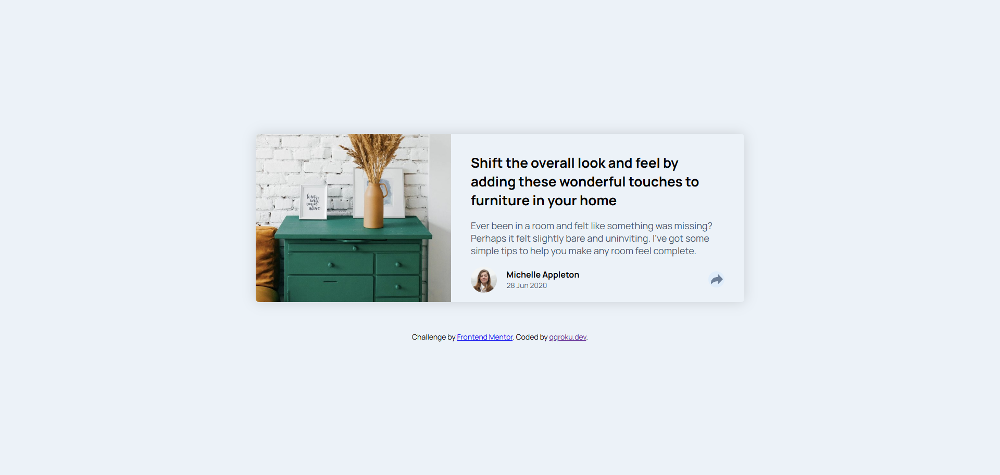
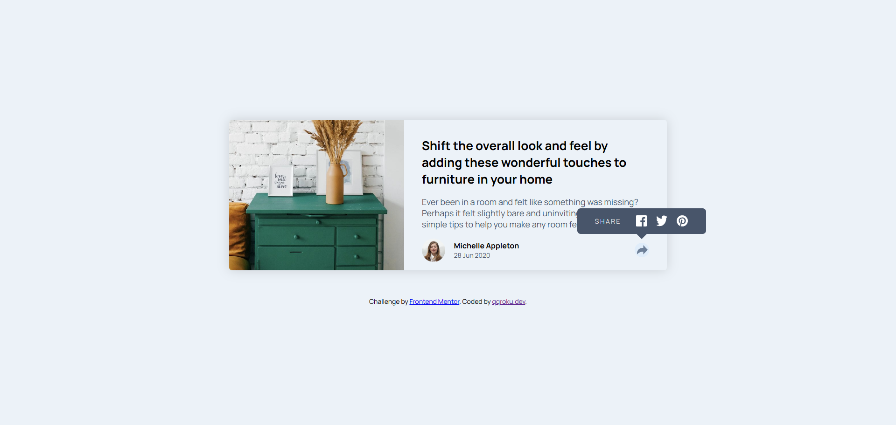
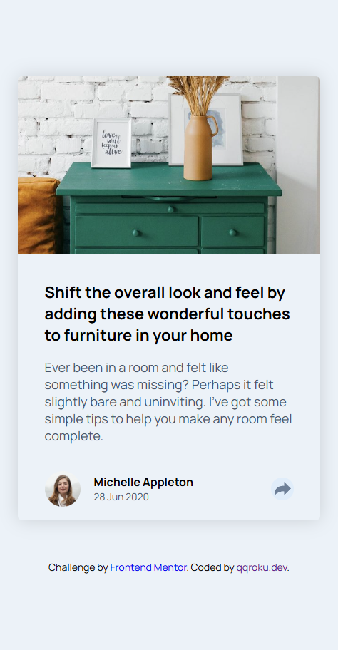

# Frontend Mentor - Article preview component solution

This is a solution to the [Article preview component challenge on Frontend Mentor](https://www.frontendmentor.io/challenges/article-preview-component-dYBN_pYFT). Frontend Mentor challenges help you improve your coding skills by building realistic projects. 

## Table of contents

- [Overview](#overview)
  - [The challenge](#the-challenge)
  - [Screenshot](#screenshot)
  - [Links](#links)
- [My process](#my-process)
  - [Built with](#built-with)
  - [What I learned](#what-i-learned)
  - [Continued development](#continued-development)
- [Author](#author)

## Overview

### The challenge

Users should be able to:

- View the optimal layout for the component depending on their device's screen size
- See the social media share links when they click the share icon

### Screenshot

### Desktop view

### Desktop view - active state

## Mobile view

### Links

- Solution URL: [solution URL](https://github.com/qqroku/Article-preview-component)
- Live Site URL: [live site URL](https://qqroku.github.io/Article-preview-component/)

## My process

### Built with

- Semantic HTML5 markup
- CSS custom properties
- Flexbox
- Responsive layout

### What I learned

I've learned how to use BEM naming convention to make the code easier to read.

### Continued development

html, css, js

## Author

- Website - [qqroku.dev](https://github.com/qqroku)
- Frontend Mentor - [@qqroku](https://www.frontendmentor.io/profile/qqroku)